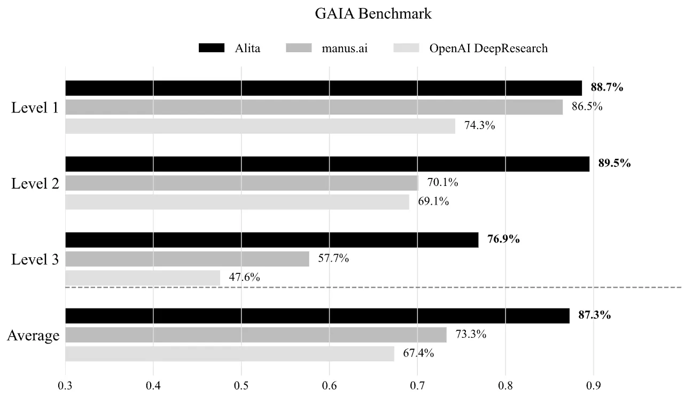
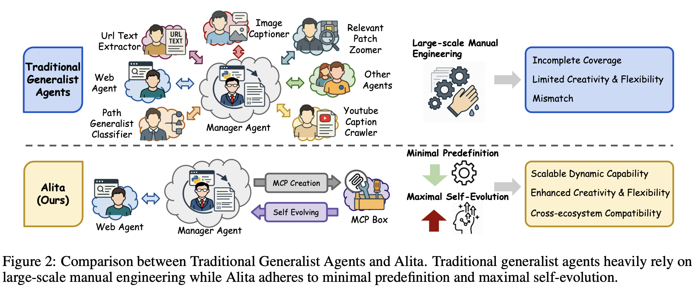

# Alita: Generalist Agent Enabling Scalable Agentic Reasoning with Minimal Predefinition and Maximal Self-Evolution

The GAIA game is over, and Alita is the final answer.
Alita takes the top spot in GAIA, outperforming OpenAI Deep Research and Manus.

Many general-purpose agents rely heavily on large-scale, manually predefined tools and workflows.  However, we believe that for general AI assistants:

**"Simplicity is the ultimate sophistication."**

🔗Full paper: [https://arxiv.org/pdf/2505.20286](https://arxiv.org/pdf/2505.20286)

🔗More Details will be updated here: [https://github.com/CharlesQ9/Alita](https://github.com/CharlesQ9/Alita)

#### **Comment 1:**

The reliance on large-scale manually predefined tools and workflows introduces several critical limitations: i) It is impractical, if not impossible, to predefine all the tools required for the wide variety of real-world tasks an agent might encounter **(imcomplete coverage)**; ii) Many complex tasks require agents to creatively compose new tools or leverage existing ones in novel ways while pre-designed workflow and hardcoded components constrain this compositional flexibility and inhibit the development of adaptive behaviors **(limited creativity and flexibility)**; iii) It is not always the case that the interface or environment of different tools are compatible with the agent **(mismatch)**. For example, many useful tools are not written in Python, which makes it difficult, though not entirely impossible, for them to be pre-connected to the mainstream agent frameworks that are primarily written in Python. Together, these challenges ultimately hinder the scalability, adaptability, and generalization of existing generalist agents.

#### **Comment2:** 

In contrast to the prevailing trend of growing complexity, we propose a radically simple design philosophy built on two principles: **i) Minimal Predefinition:**  Equip the agent with only a minimal set of core capabilities, avoiding manually engineered components for specific tasks or modalities; **ii) Maximal Self-Evolution:** Empower the agent to autonomously create, refine, and reuse external capabilities as needed. We instantiate this vision through Alita, a generalist agent built with a single core capability (i.e., the web agent) and a small set of general-purpose modules that enable self-directed capability expansion. Specifically, we take advantage of the Model Context Protocols (MCPs) which is an open protocol that standardizes how different systems provide context to LLMs, and empower Alita to dynamically generate, adapt, and reuse MCPs based on the demands of each task rather than relying on static, predefined tools. **This shift from manually designed capabilities to on-the-fly MCP construction unlocks a new path for building agents that are simple yet profoundly capable.**

#### Comment3:

**Auto MCP Creation vs  Auto Tool Creation:**

Additional benefits of MCP creation over tool creation include better reusability and easier environment management. Auto MCP creation might be the future mainstream.

#### Comment4:

Alita-generated MCP Box has two benefits.

**i)Agent Distillation:** The reuse of auto-generated MCPs can be viewed as a way of **distillation,** which is much cheaper and easier.

**Stronger Agent teaches Weaker Agent:**

These MCPs can be reused by other weaker agents and improve their performance since Alita, instead of human developers, designs a set of useful MCPs fit to GAIA by trial and error. 

**Agent with Larger LLMs teaches Agent with Smaller LLMs:**

These MCPs can also be reused by agents with smaller LLMs and **significantly** improve the performance. 

**ii)Make Pass@1 approach Pass@N**

The MCP Box can also be connected to Alita, and makes pass@1 approach Pass@N.

#### Comment5:

**Claude-Sonnet-4 vs Claude-3.7-Sonnet:**

Another interesting observation is that when we replace Claude-3.7-sonnet with Claude-sonnet-4, the accuracy on Level1 **significantly decreases** from 96.23% pass@3 to 88.68% **though the overall performance increases.** We have not fully understood the reasons behind this phenomenon.

#### Comment6:

We also believe **Alita will be even stronger with LLMs' increasing coding and reasoning capabilities in the future**. The design of future general AI assistants might be much simpler, without any predefined tools and workflows for direct problem-solving. Instead, human developers might focus more on designing modules to enable and stimulate the creativity and evolution of generalist agents.

#### Comment7:

We manually test some agent products on GAIA. Some companies may falsely advertise their agent performance.

#### Comment8:

There’s a gap between the GAIA validation and test datasets. In detail, the GAIA test dataset focuses more on web browsing ability and less on tool use. Our web agent is very simple and supports very few actions, but it is enough for the validation dataset. However, our performance drops a lot on the GAIA test, though we still rank high. With the MCP creation component, Alita achieves around a 15% increase in pass@1 on the GAIA test dataset compared to Alita without the MCP creation component, while the increase on GAIA validation is higher.

#### Comment9:

Maybe it’s time to move forward to HLE, BrowseComp, and xbench.